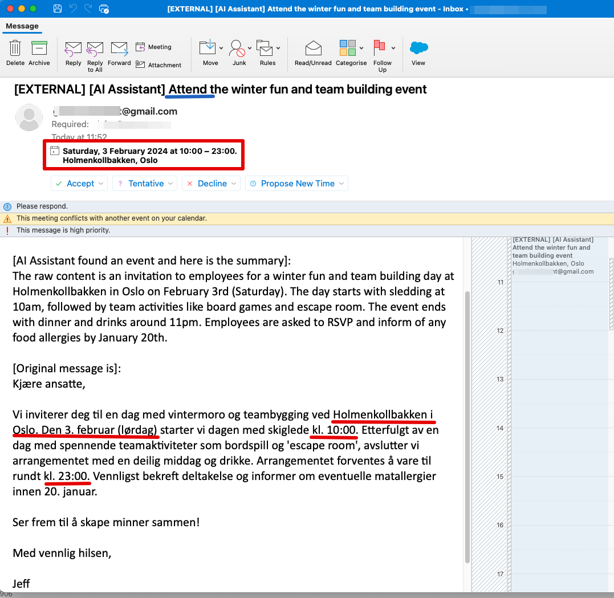
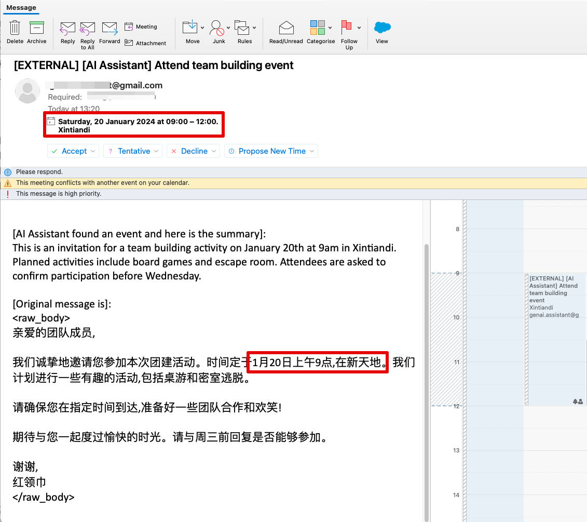

# Build your multilingual personal calendar assistant with Amazon Bedrock and AWS Step Functions

## 1. Introduction
Foreigners and expats living in a foreign country are dealing large number of emails in various languages daily. They often find themselves struggling with language barriers when it comes to setting up reminders for events like business gathering and customer meetings. To solve the problem, this post shows how to apply AWS services such as Amazon Bedrock, AWS Step Functions and Amazon Simple Email Service (AWS SES) to build a fully-automated multilingual calendar AI assistant. It understands the incoming messages, translate that to preferred language and automatically setup calendar reminders.  

### 1.1 Screenshots
Generated calendar reminder from an email in Norwegian


Generated calendar reminder from an email in Chinese


## 2. Architecture


## 3. Deployment instructions
You can deploy the solution by using AWS Cloud Development Kit (AWS CDK) in this repository.

### 3.1 Prerequisite
- [Amazon Bedrock access setup](https://docs.aws.amazon.com/bedrock/latest/userguide/model-access.html) for Anthropic's Claude V2 model in the deployment region
- [Create and verify identities in Amazon SES](https://docs.aws.amazon.com/ses/latest/dg/creating-identities.html): If your Amazon SES is in sandbox mode, you need to verify YOUR_SENDER_EMAIL and YOUR_RECIPIENT_EMAIL in SES. You will also pass the YOUR_SENDER_EMAIL and YOUR_RECIPIENT_EMAIL as parameters during CDK deployment

### 3.2 Deploy the CDK stack

1. [Setup](cdk-readme.md) python virtual environment and install packages

2. Synthesize the CloudFormation template and deploy
```
cdk deploy --parameters senderEmail=YOUR_SENDER_EMAIL --parameters recipientEmail=YOUR_RECIPIENT_EMAIL
```
Take the note of the output of API Gateway endpoint "GenaiCalendarAgentStack.APIUrl", you will need it for testing and/or connect to your email webhook.
```bash
# Outputs:
# GenaiCalendarAgentStack.APIUrl = https://[random_value].execute-api.[region].amazonaws.com/prod/
```

## 4. Test the solution 
You can test the solution by calling API Gateway endpoint, use [one of the sample inputs](./doc/sample-inputs/chinese1.json)

```
apigw=[THE_VALUE_OF_GenaiCalendarAgentStack.APIUrl]

curl -v -X POST $apigw -d @./doc/sample-inputs/norsk1.json --header "Content-Type: application/json"
curl -v -X POST $apigw -d @./doc/sample-inputs/chinese1.json --header "Content-Type: application/json"
curl -v -X POST $apigw -d @./doc/sample-inputs/english1.json --header "Content-Type: application/json"
```

Within 1-2 min, email invitations should be sent to YOUR_RECIPIENT_EMAIL address from YOUR_SENDER_EMAIL. 

## 5. Connect email webhook
Thanks to the API Gateway, there are many ways to integrate this GenAI calendar assistant with your current workflow, such as Microsoft Power App, Gmail webhook, Amazon SNS and directly API call. 

Here we demonstrate to use Zapier Email webhook, for connecting an email inbox with this GenAI calendar assistant. Please [follow the instruction at here](./doc/zapier-setup/readme.md).


## 6. Clean up
From the root directory of the source code, run:
```
cdk destroy
```

## Security

See [CONTRIBUTING](CONTRIBUTING.md#security-issue-notifications) for more information.

## License

This library is licensed under the MIT-0 License. See the [LICENSE](LICENSE.md) file.

## DISCLAIMER

The solution architecture sample code is provided without any guarantees, and you're not recommended to use it for production-grade workloads. The intention is to provide content to build and learn. Be sure of reading the licensing terms.