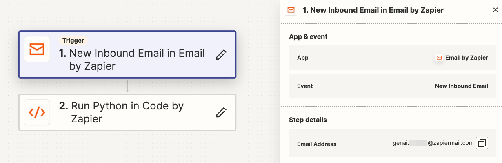
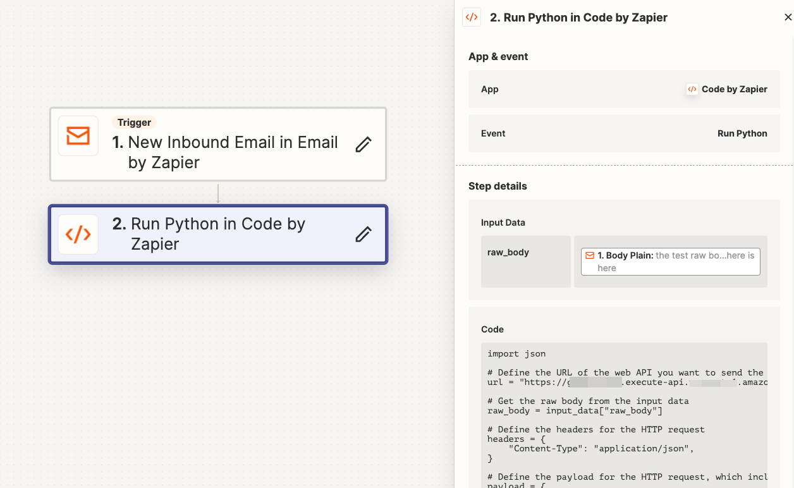

# Setup your zapier email webhook
This document shows the steps for setting up a zapier email webhook. 

Once the setup is done, you will have a YOUR_ZAPIER_APP_ID@zapier.com email box. This email box has a workflow that send the body of incoming email to the GenAI calendar agent solution (via AWS API Gateway). 

Then you can forward emails to this zapier mailbox, and the GenAI calendar agent will process them and send you calendar reminders. 

### 1. Create a zapier account with free plan at https://zapier.com/

### 2. Create a new zapier app
The zapier app is a workflow with 2 steps

2.1. Zapier app workflow step 1
- Name: New Inbound Email in Email by Zapier
- App & event: Email by Zapier
- Event: New Inbound Email


(screenshot of Zapier app workflow step 1)

2.2. Zapier app workflow step 2
- Name: Run Python in Code by Zapier
- App & event: Code by Zapier
- Event: Run Python
- Action Input Data: raw_body
- Action Input Data field: 1. Body Plain
- Code

```python
import json

# Define the URL of the web API you want to send the raw body to
# Use the output of CDK API Gateway
url = "[THE_VALUE_OF_GenaiCalendarAgentStack.APIUrl]"

# Get the raw body from the input data
raw_body = input_data["raw_body"]

# Define the headers for the HTTP request
headers = {
    "Content-Type": "application/json",
}

# Define the payload for the HTTP request, which includes the raw body
payload = {
    "raw_body": raw_body,
}

# Send a POST request to the specified URL with the defined headers and payload
response = requests.request("POST", url, headers=headers, data=json.dumps(payload))

# Print the response from the web API
print(response.text)

# Define the output as a dictionary with the key "response" and the value as the text of the response
output = {"response": response.text}
```

(screenshot of Zapier app workflow step 1)